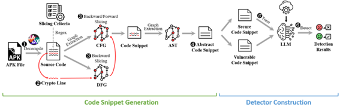

# CryptoLLM

This repository contains the PyTorch implementation of **"CryptoLLM: Harnessing the Power of LLMs to Detect Cryptographic API Misuse"**


## Introduction
This code allows you to run CryptoLLM, a cryptographic API misuse detection tool.

The following is the workflow of CryptoLLM:
<p align="center"></p>


## Requirements
### Environment
- Ubuntu 18.04 server equipped with an Intel (R) Xeon (R) CPU at 3.10GHz, 251.0 GB RAM
- NVIDIA Tesla V100-PCIe GPU with 32GB memory
- Python 3.8.19
- JDK 17.0.7


### Install
1. The `requirements.txt` file lists all libraries for running, which are installed using:
```
pip install -r requirements.txt
```

2. To decompile the APK, you have to install [Jadx](https://github.com/skylot/jadx), a tool that requires JDK 11 or higher to run, in `./tool`.


## Model
We use four models (**CodeBERT-base**, **CodeGPT-small**, **CodeT5-small**, **ELECTRA-base**) in our experiments.

You can train the models and apply them to CryptoLLM.

### Dataset
* Original Dataset: 17,661 (benign: 8,689/misuse: 8,972)
  * train: `train/dataset/train_dataset.jsonl`
  * valid: `train/dataset/valid_dataset.jsonl`
  * test: `train/dataset/test_dataset.jsonl` 
* Original + Mutated Dataset: 97,962 (benign: 41,018/misuse: 56,944)
  * train: `train/dataset/train_mutated_dataset.jsonl`
  * valid: `train/dataset/valid_mutated_dataset.jsonl`
  * test: `train/dataset/test_mutated_dataset.jsonl` 

### Train and Test
* Train

You can change the dataset to suit the task you want to work on, in *--train_file* and *--valid_file* of `run_<model>.sh`.
```
cd train/<model>  # <model>: codebert, codegpt, codet5, electra
sh run_<model>.sh
```

* Test

You must enter the bin file path, which is the model output of train, in *--test_model* of `test_<model>.sh`.

You can change the dataset to suit the task you want to work on, in *--test_file* of `test_<model>.sh`.
```
sh test_<model>.sh
```


## How to Run
